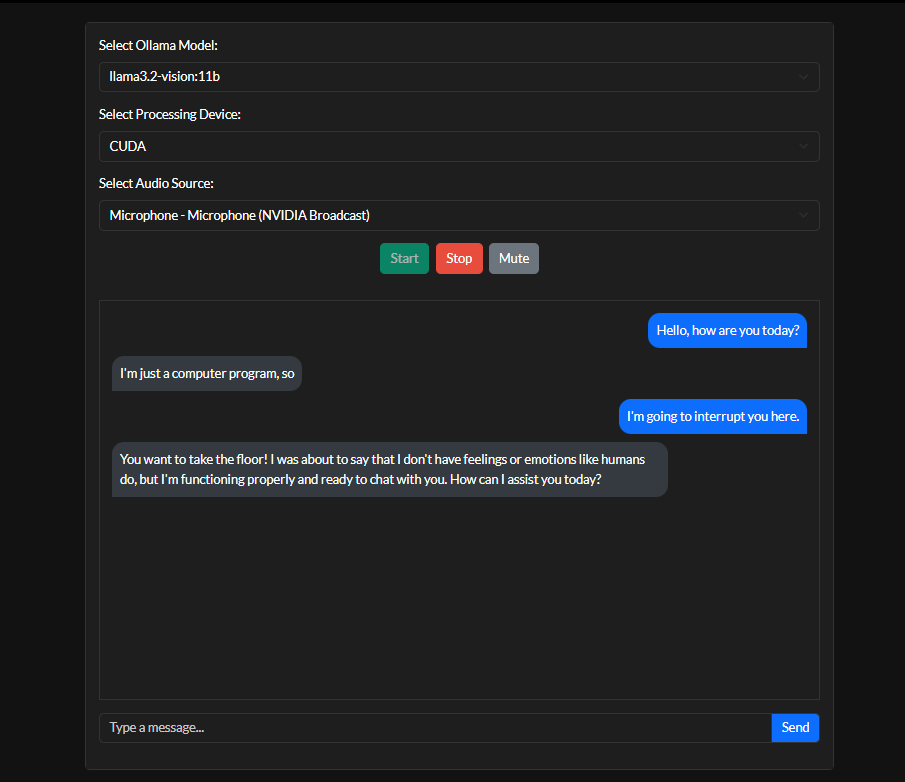

## **Project Name: WhisperLlama Wrapper – Real-Time Speech-to-AI with Interruptions**  

### **Description**  
WhisperLlama Wrapper is a **real-time, local speech-to-text AI system** that integrates OpenAI’s **Whisper-large-v3-turbo** for transcription and Ollama’s **llama3.2-vision:11b** for intelligent, context-aware responses.  

Unlike standard Llama model implementations, this wrapper **allows real-time interruptions**, making AI conversations more **dynamic and responsive**. Instead of waiting for full responses, users can **interject naturally**, and the AI adapts to new input immediately—mirroring real human conversations.  

This project runs **entirely offline**, ensuring **privacy and security** while utilizing **CUDA acceleration** for fast, efficient processing.  



### **Key Features**  
- **Real-Time Speech-to-Text**: Uses Whisper-large-v3-turbo for accurate transcription.  
- **Interrupt-Friendly AI Responses**: Unlike most AI models, this wrapper allows real-time user interruptions via voice and text.
- **Fully Local & Private**: Runs completely offline with no cloud dependencies.  
- **Voice Activity Detection**: Detects speech automatically and ignores silence.  
- **Multi-Source Audio Capture**: Works with both microphone and system audio.  
- **GPU Acceleration**: Uses CUDA for optimized performance.  
- **Modern UI**: A simple, sleek web interface built with **Eel and Bootstrap**.  

### **Example Usage Screenshot**  
Below is an example of the **real-time interruption feature** in action:  

  

### **Installation**  
Clone the repository and install dependencies:  
```bash
git clone https://github.com/yourusername/whisperllama-wrapper.git  
cd whisperllama-wrapper  
pip install -r requirements.txt  
```

Run the application:  
```bash
python main.py  
```
